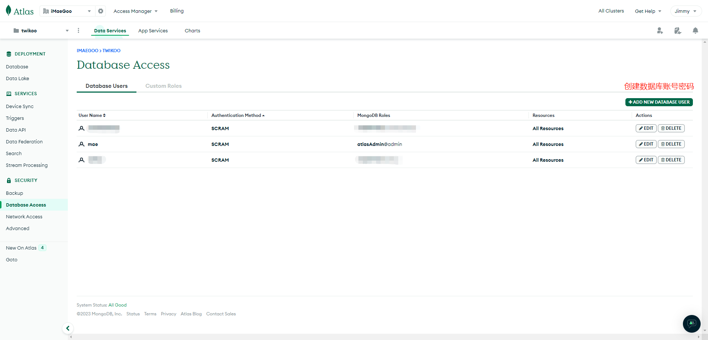
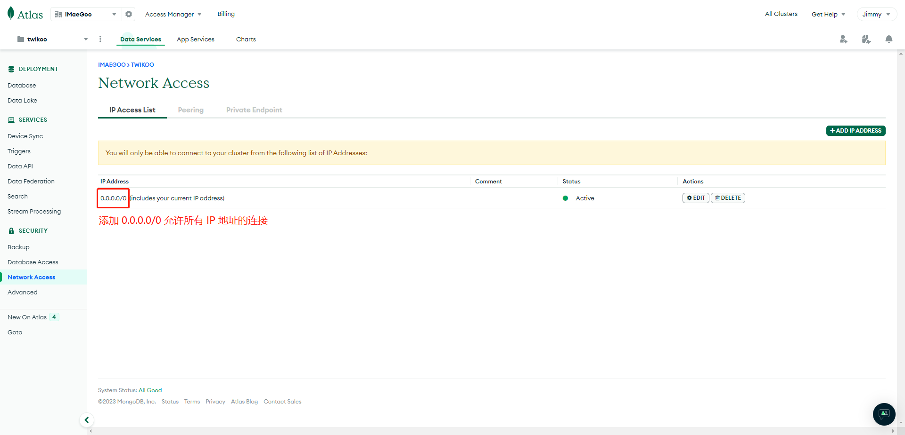
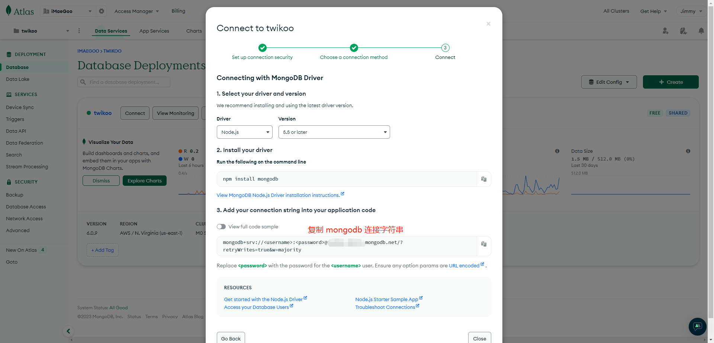

# MongoDB Atlas

MongoDB Atlas is a MongoDB database hosting service provided by MongoDB Inc. The free account offers permanent use of a 500 MiB database, which is sufficient for storing Faker Server data.

1. Apply for an [MongoDB AtLas](https://www.mongodb.com/cloud/atlas/register) account
2. Create a free MongoDB database, and select a data center close to your Faker Server backend location for lower database connection latency. If you are unsure about your backend location, you can also choose `AWS / Oregon (us-west-2)`, which has a mature infrastructure, low failure rate, and uses clean energy from Oregon, which is more environmentally friendly.
3. Click Add New Database User on the Database Access page to create a database user. Set Authentication Method to Password, set the database user name and password in Password Authentication, and click Auto Generate to automatically generate a strong password without special characters and save it. Click Add Built In Role in Database User Privileges, select Role as Atlas Admin, and finally click Add User

4. Click Add IP Address on the Network Access page to add a network whitelist. Because the exit address of Vercel / Netlify / Lambda is not fixed, you can enter `0.0.0.0/0` (allow connections from all IP addresses) in Access List Entry. If Faker Server is deployed on your own server, you can fill in a fixed IP address here. Click Confirm to save

5. Click Connect on the Database page, select Drivers, and record the database connection string. Please modify `<username>:<password>` in the connection string to the database `username:password` you just created

6. (Optional) The default connection string does not specify a database name, so Faker Server will connect to the default database. If you need to run other businesses in the same MongoDB or use them by multiple Faker Server instances, create a database name and configure the corresponding ACL.

The connection string contains all the information needed to connect to the MongoDB database. If it is leaked, it can lead to the interface being added, modified, or deleted by anyone, and it may also obtain information from your production environment. Please keep this string properly recorded, and then fill it into the deployment platform of Faker Server.
