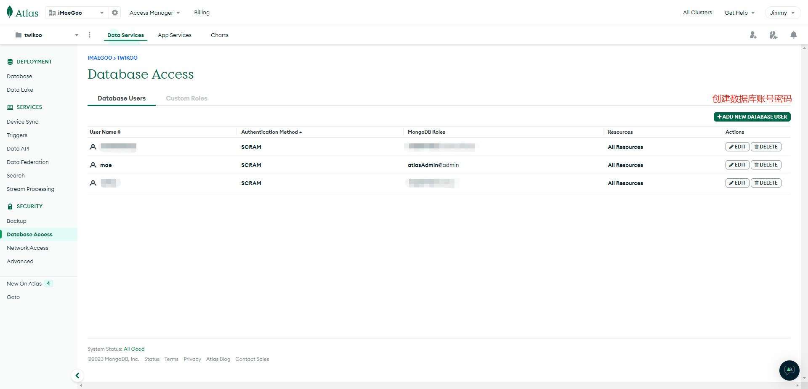
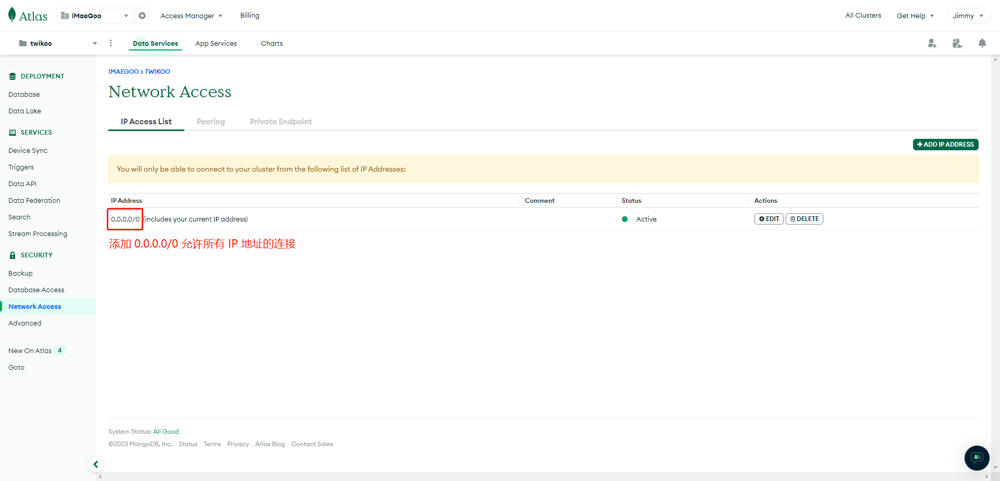
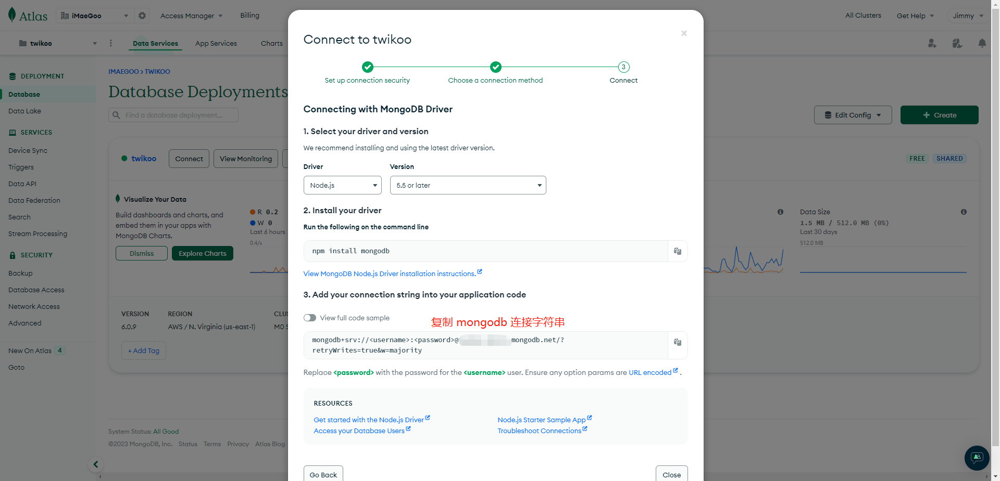

# MongoDB Atlas

MongoDB Atlas 是 MongoDB Inc 提供的 MongoDB 数据库托管服务。免费账户可以永久使用 500 MiB 的数据库，足够存储 Faker Server 数据使用。

1. 申请 [MongoDB AtLas](https://www.mongodb.com/cloud/atlas/register) 账号
2. 创建免费 MongoDB 数据库，区域推荐选择离 Faker Server 后端地理位置较近的数据中心以获得更低的数据库连接延迟。如果不清楚自己的后端在哪个区域，也可选择 `AWS / Oregon (us-west-2)`，该数据中心基建成熟，故障率低，且使用 Oregon 州的清洁能源，较为环保
3. 在 Database Access 页面点击 Add New Database User 创建数据库用户，Authentication Method 选 Password，在 Password Authentication 下设置数据库用户名和密码，建议点击 Auto Generate 自动生成一个不含特殊符号的强壮密码并妥善保存。点击 Database User Privileges 下方的 Add Built In Role，Select Role 选择 Atlas Admin，最后点击 Add User

4. 在 Network Access 页面点击 Add IP Address 添加网络白名单。因为 Vercel / Netlify / Lambda 的出口地址不固定，因此 Access List Entry 输入 `0.0.0.0/0`（允许所有 IP 地址的连接）即可。如果 Faker Server 部署在自己的服务器上，这里可以填入固定 IP 地址。点击 Confirm 保存

5. 在 Database 页面点击 Connect，连接方式选择 Drivers，并记录数据库连接字符串，请将连接字符串中的 `<username>:<password>` 修改为刚刚创建的数据库 `用户名:密码`

6. （可选）默认的连接字符串没有指定数据库名称，Faker Server 会连接到默认数据库。如果需要在同一个 MongoDB 里运行其他业务或供多个 Faker Server 实例使用，建立加入数据库名称并配置对应的 ACL。

连接字符串包含了连接到 MongoDB 数据库的所有信息，一旦泄露会导致接口被任何人添加、修改、删除，并有可能获取你的生产环境信息。请妥善记录这一字符串，之后需要填入到 Faker Server 的部署平台里。